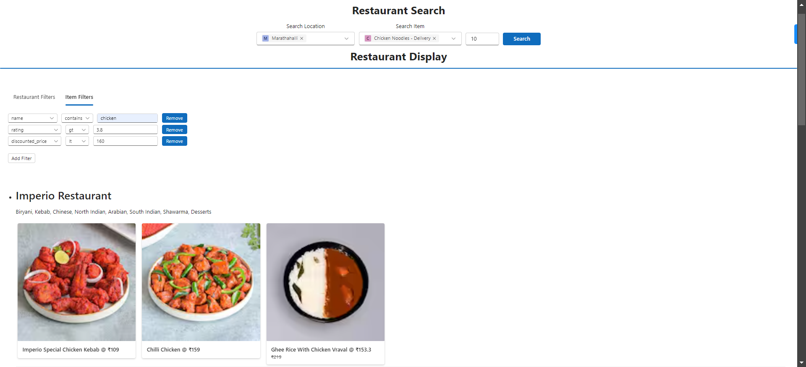

# Zomauto - Automation Project

This project automates interactions with the Zomato website, utilizing Playwright for web scraping and automation. It is designed to extract information about restaurants, such as menu items, prices, and offers, and perform specific automated tasks based on that data.

## Features

- **Automated Navigation**: Automatically navigates through Zomato's restaurant pages.
- **Data Extraction**: Extracts data such as restaurant offers, menu items, and their prices.
- **Price Calculation**: Calculates discounted prices for menu items based on available offers.

## Screenshots




## Setup

To run this project, you need Python installed on your system. Additionally, the project requires Playwright and its necessary WebDriver for the browser you intend to use (e.g., Edge).

### Dependencies

- Python 3.x
- Playwright

### Installation

1. Clone the repository to your local machine.
2. Install the required Python packages:
    ```bash
    pip install -r requirements.txt
    ```

### Configuration

Before running the script, configure the project by editing the `config.json` file to match your preferences and requirements.

### Usage

To start the automation, run the main.py script:
```bash
python main.py
```
The script initializes a Selenium WebDriver, loads the Zomato website, and performs the automated tasks as programmed.

## Structure

* `main.py`: The entry point of the application. It sets up the environment, loads configuration, and starts the automation process.

* `zomato.py`: A wrapper class that encapsulates all interactions with the Selenium WebDriver for navigating and extracting data from Zomato.

## Disclaimer

This project is for educational purposes only. Automated web scraping may violate the terms of service of some websites. Use responsibly and ethically.

